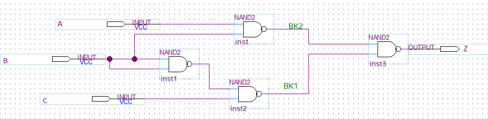
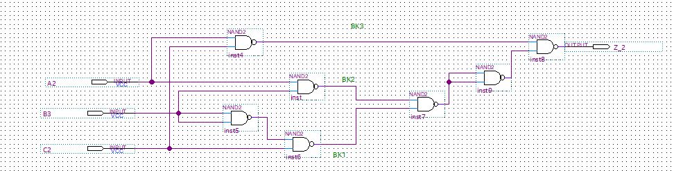
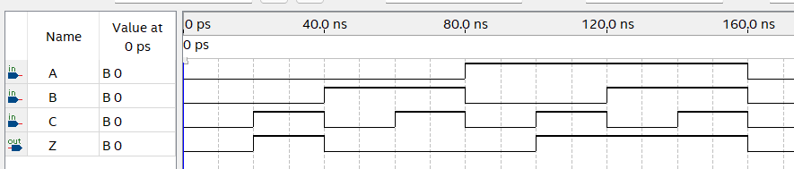
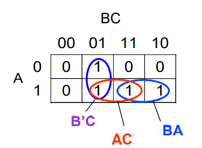
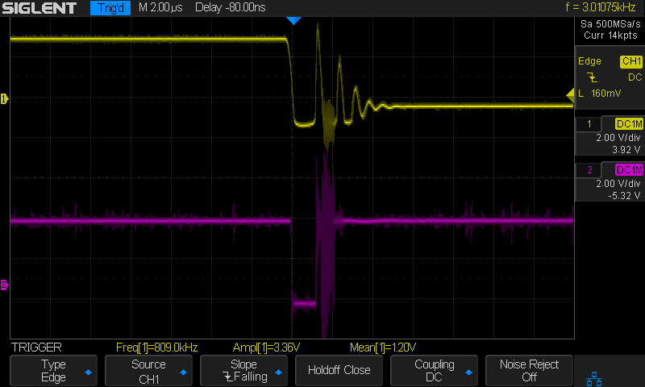
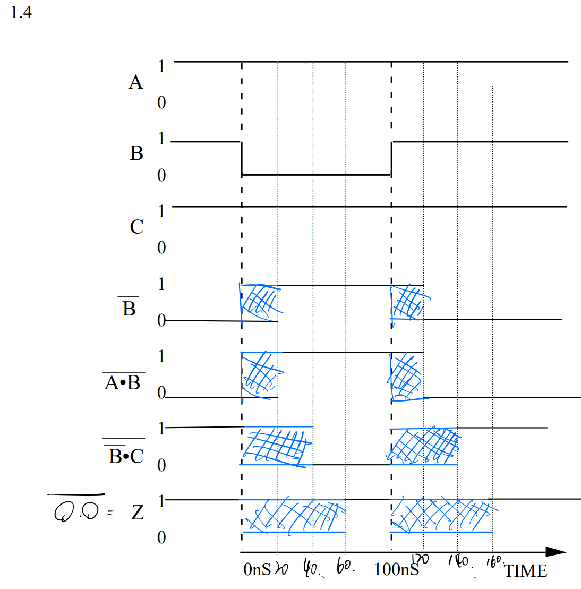

## Lab1 Report

Qian Liyang 3190110719

### Introduction

​		We often assume that the circuit component has no time delay. However, there are some time delays in real circuit component. Lab 1 makes students implement the inside structure of a **2-1 Mux** with only NAND2 components. And lab 1 also introduces the phenomenon of **static hazard** and the way to eliminate the **static hazard**. 

### Circuit diagrams and Descriptions to the operations of circuits

#### Circuits in pre-lab (a)

​		The graph above shows the structure of a 2-1 Mux with input A, B, C and output Z, where Z = AB + not(B)C. The input signal B is the select signal, when B is high, then the value on wire **BK1** will be constantly 1, and the value on **BK2** will be ***not(A)***, then the Z will be ***not(not(A))***, which is A.

​		Similarly, when the B is 0, the value on wire BK2 will constantly be 1, and the value on wire BK1 will be ***not(C)***. Z will be C

#### Circuits in pre-lab (b)

​	Comparing with the circuit in part (a), the circuit in part(b) add an adjacent min-terms to eliminate the effect of static hazard, resulting the output Z' = Z + AC. 

​	Then we need to exam its influence on output Z. When one of the inputs A, B is 0, the term AC is 0, so Z' = Z, indicating that AC has no effect. Then when AC is all 1, Z' = Z = 1 constantly. Therefore, adding the adjacent min-terms will not affect the output Z', and the circuit can also work as a 2-1 MUX.

#### Schematic

### .jpg)Documentation from all parts of the lab

#### Lab part 1:

Since we use the $Quarts$, the simulation signals are clearly $logical \ 0 \ $or $\ logical \  1$. 

#### **Lab part 2:**

​	**pre_lab(a):**

|  A   |  B   |  C   |  Z   |
| :--: | :--: | :--: | :--: |
|  0   |  0   |  0   |  0   |
|  0   |  0   |  1   |  1   |
|  0   |  1   |  0   |  0   |
|  0   |  1   |  1   |  0   |
|  1   |  0   |  0   |  0   |
|  1   |  0   |  1   |  1   |
|  1   |  1   |  0   |  1   |
|  1   |  1   |  1   |  1   |

Using the *K-map*, we can get the final formula:

​	
$$
Z = AB + B'C
$$

#### Lab part 3:

​	As shown in the above figure, there is a glitch when signal B changes from 1 to 0 even though the inputs $A, C$ are both 1. 

#### Lab part 4:

Truth Table of the output of **pre_lab(b)**

|  A   |  B   |  C   |  Z   |
| :--: | :--: | :--: | :--: |
|  0   |  0   |  0   |  0   |
|  0   |  0   |  1   |  1   |
|  0   |  1   |  0   |  0   |
|  0   |  1   |  1   |  0   |
|  1   |  0   |  0   |  0   |
|  1   |  0   |  1   |  1   |
|  1   |  1   |  0   |  1   |
|  1   |  1   |  1   |  1   |

​	The truth table is as same as the truth table in **pre_lab(a)**. 

.bmp)

​	The glitch has been eliminated because of adding an adjacent min-terms. 

#### Questions posted in the pre-lab

There is no any question in the pre-lab section. 

### Answers to all post-lab questions

It takes 60ns for the output $Z$ to stabilize on the failing edge of $B$. And it also takes 60 ns for the output $Z$ to stabilize on the rising edge of $B$. 

Yes, there are some potential glitches in the output $Z$ since the output $Z$ comes from a TTL circuit of the inputs $A,B,C$. The circuit components will have respective delays, which will finally turn the change of inputs into a glitch to the output $Z$.  

### Answers to questions from the GG

#### GG.6

1. The advantages of a larger noise immunity is to stabilize the output signal to set off the noise from input.

2. By designing purpose, we often treat the circuit as a black box, so the relationship between the input and the output is what we interest in. Therefore, we need to measure the last inverter to get the specific output relating to the specific input.

##### 3. noise immunity:

(a): noise immunity for $logic \ 0$: the low point of range is the stable output voltage defined as $logic \ 0$ for the inverter, .35V in the example, with symbol $L_f$. And $L_r$ is defined as the input voltage whose output voltage is the bottom of nominal range for $logic \ 1$, 1.15V in the example. noise immunity for $logic \ 0$ is $L_r - L_f$.

(b): noise immunity for $logic \ 1$: the $H_r$ is defined as the stable voltage which is the $logic \ 1$ voltage in the inverter, 3.5V in the example. And $H_l$ is defined as the smallest voltage to generate stable $logic \ 0$ voltage of the inverter, 1.35V in the example. Noise immunity for $logic \ 1$ is $H_r - H_f$.

#### GG.29 

By sharing the resistors, the total resistance of parallel $LEDs$, $R_t$, is smaller than the smallest resistance of all $LEDs$. Therefore, when connecting to the power source, the IC will have a larger current in the main wire will surpass the maximum and then burn the IC to the ground.  

### Conclusion

By adding an adjacent min-term to the NAND IC that reaches the function of a 2-1 MUX, the object IC gains some noise immunity to the input signal, which eliminates the glitch.

