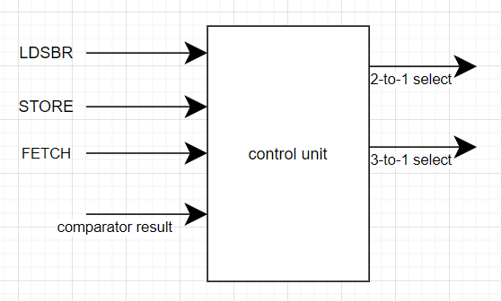
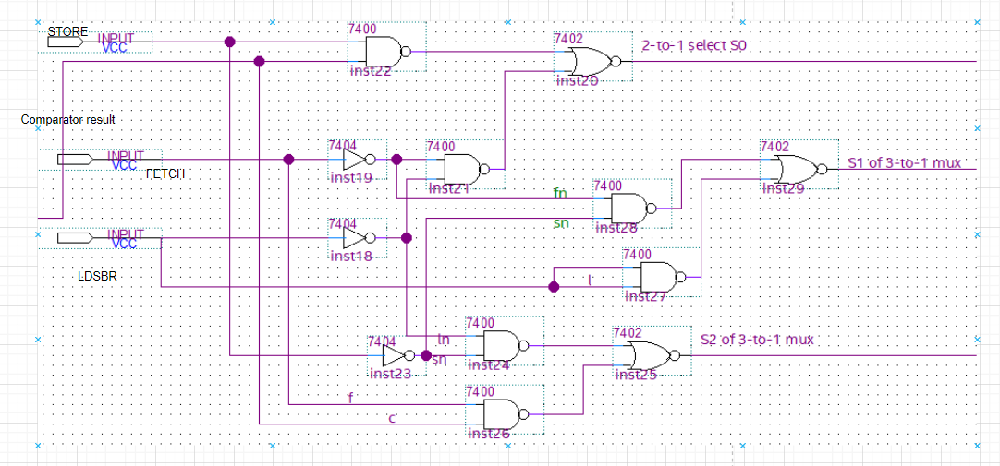
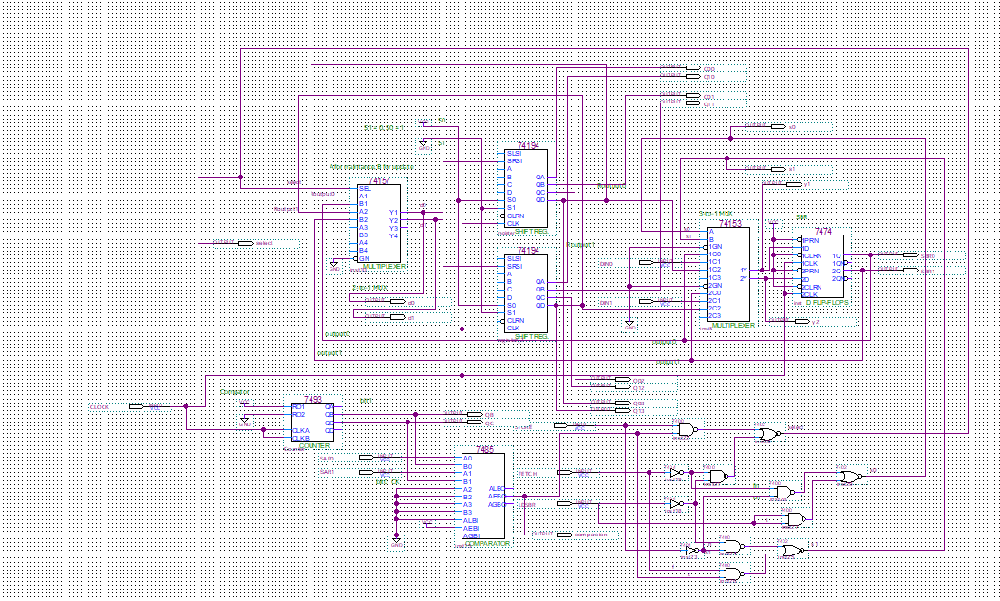
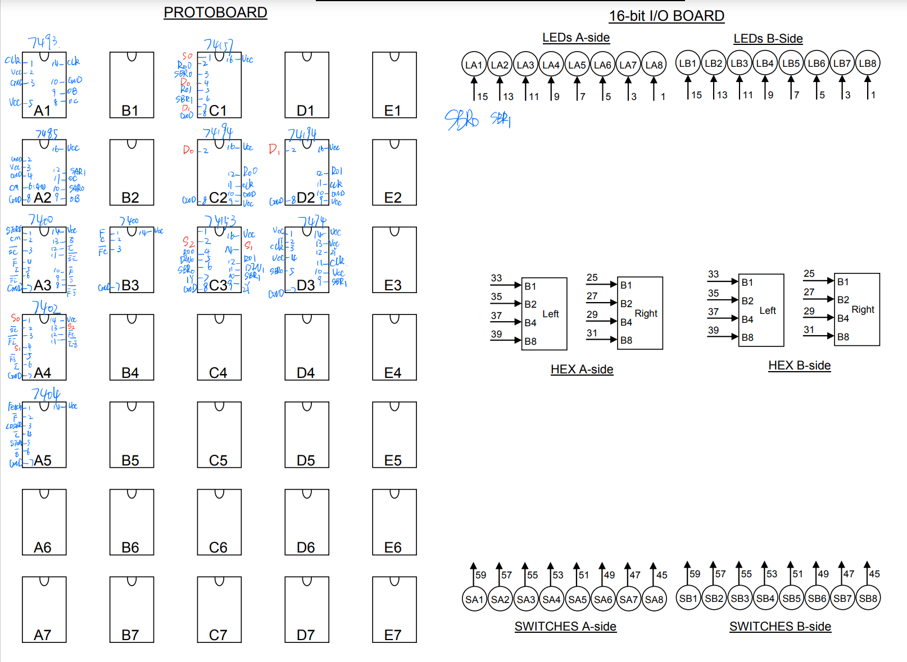

## Lab2 Report

Qian Liyang 3190110719

### Introduction

​	In this lab, we design a 2-bit 4 words right-shift memory, which can contain 4 2-bit words. The circuit has 5 kinds of input signal: *SAR, DIN, FETCH, STORE, LDSBR*. When *FETCH* is high, the circuit will read the output of right-shift memory into the *SBR* for output. When *STORE* is high, the circuit will write the data from *SBR* to right-shift memory according to the address from *SAR*. When *LDSBR* is high, the circuit will load *DIN* into *SBR*.

### Operation of the memory circuit

1. There is a comparator which will compare the value of **SAR** with the value of **SBR**, when the output is 1, we know **SAR** = **SBR**. And then when *LDSBR* is high, the circuit will load *DIN* into *SBR*. When *FETCH* is high, the circuit will read the output of right-shift memory into the *SBR* for output. When *STORE* is high, the circuit will write the data from *SBR* to right-shift memory. 
2. The data in right-shift memory is shift from left to right, which means when the data written will be outputted after 3 clocks. To write a data, we firstly set *LDSBR* to high and then set *STORE* to high with *LDSBR* off. Finally, when the comparator exports high, the data will be written into the memory.
3. same data flow as above. When reading a data, we need to set the *FETCH* high and wait until the comparator exports high. Then the data will be read into SBR.

### Written description and block diagram of implementation

#### High-level description

1. component

   two 2-to-1 multiplexer which is used to maintain data or load data in *SBR*

   two 3-to-1 multiplexer which is used to maintain data in *SBR*, read *DIN* or read output of memory.

   two right-shift memory units to store data

   two D flip-flops as SBR

   a counter to count from 0 to 3

   a comparator to compare SAR with counter

   some NAND and NOR gates to build control unit. 

2. block diagram (unfinished)

   connect the components mentioned above to implement a 2 bit, 4 words right-shift memory.

#### Control Unit

1. There are two signals as the output of control unit, the select signal to control the 2-to-1 multiplexer, ***S0***, and the select signal to control 3-to-1 multiplexer, ***S1S2***. When *FETCH* is high, we need to wait the signal from comparator becoming high and then set select signal ***S1S2*** to 2, which will load the data from right-shift memory into *SBR*. When *LDSBR* is high, the select signal ***S1S2*** is set to 1, which will load the *DIN* to *SBR*. Finally, when *STORE* is high, the unit needs to wait the comparator becoming high hand then set select signal ***S0*** to 1, which will over-write the data in memory by the data in *SBR* according to *SAR*.

2. High level diagram:

   ****

3. detailed logical diagram:

   

### Design steps taken and detailed circuit schematic

#### Design steps taken(unfinished)

#### Detailed Circuit Schematic

### Layout Sheet 

### Conclusion

The lab creates a chance for us to explore the operation process of a memory. What we think the most important is the point that how the memory can store a data in the expect address. And our memory will have 3 inputs, *FETCH*, *STORE* and *LDSBR*. When we store a *DIN*, the role *SBR* play is more like a buffer.

#### Pre-lab question

The clock needs to be de-bounced because the unexpected bouncing on clock will affect the current situation of clock, generating unexpected clock edges, which will be propagated and enlarged the mistake to the entire circuit since many components work depending on the rising edge of clock or the falling edge of clock. But for other components in our circuit, they do not need to be de-bounced because the inside mechanism of them have the ability to resist noise.

#### Post-lab question

1. ​	The bug we encounter is the high and low bit of a 3-to-1 multiplexer, indicating that whenever we use a new circuit component or we use a circuit component which we are not very familiar with, we need to read the data sheet careful to figure out the operation process of the components.

2. ​    According to the Wikipedia we found, the current SRAM can work at the speed of 20ns or faster. Compared with the SRAM, our right-shift memory, after storing a data, needs to waiting for 4 clock period to read the data from the same address, which is 80ns. 

3. ​    In a standard lab kit of IC's, there are two kinds of different counters, 4-bit ripper counter(SN7493) and 4-bit synchronous Up-Down Counter(SN74LS169A and SN74193). The difference among these counters is the counting sequence, ripper counter counting from 0 to 15 but Up-Down counter counting from 15 to 0. We choose the 4-bit ripper counter because we can easily foresee the value of counter according to the clock periods, and then we can debug the circuit better. However, the SN7493 is asynchronous, which may cause some potential problems.

   ​    And there are also two kinds of registers in the lab kit, which are 4-bit parallel-access shift register and 4-bit bidirectional universal shift register. We use the SN74194 because it has the detailed inside construction on the data sheet. And it is 4-bits, which means we can use two 194 registers to stimulate a 2-bit 4-words memory.
